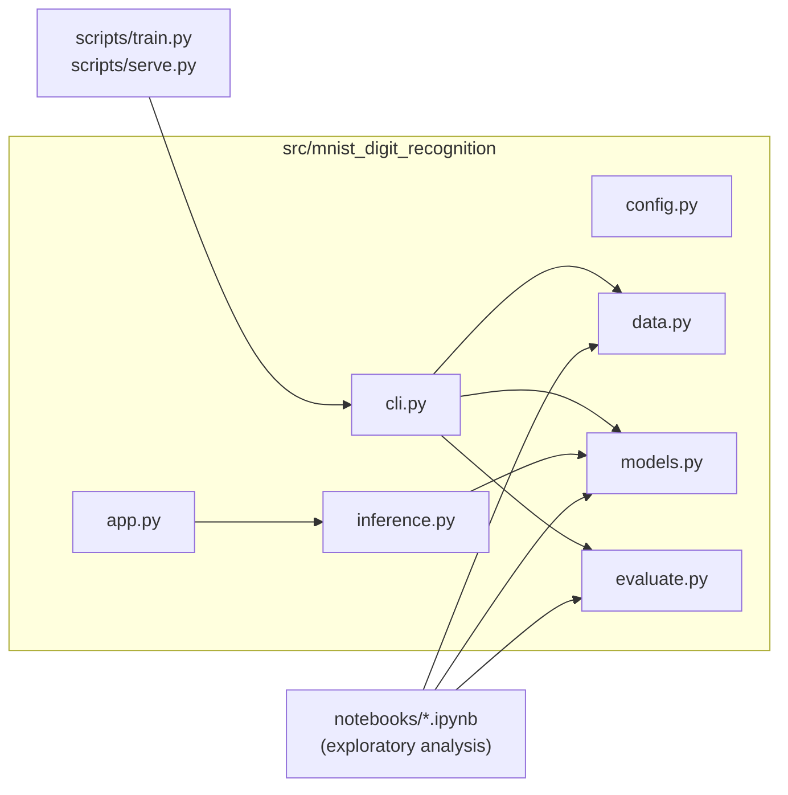

# MNIST Digit Recognition

[](https://github.com/Shahoud867/MNIST_Digit_Recognition/actions/workflows/ci.yml)
[](LICENSE)
[](pyproject.toml)
[](https://github.com/psf/black)
[](https://github.com/astral-sh/ruff)

A complete, tested machine learning pipeline for handwritten digit classification on MNIST — with a proper Python package, CI/CD, Docker support, and an interactive Gradio web demo.

> **Note on scope**: this is a portfolio/reference project demonstrating engineering practices (testing, CI, packaging, containerization) around a classical scikit-learn pipeline. It is not a hosted production service.

## Table of Contents

- [Features](#features)
- [Architecture](#architecture)
- [Results](#results)
- [Installation](#installation)
- [Usage](#usage)
- [Configuration](#configuration)
- [Docker](#docker)
- [Testing](#testing)
- [Project Structure](#project-structure)
- [Contributing](#contributing)
- [License](#license)

## Features

- 📥 Loads and preprocesses MNIST from OpenML (784-pixel grayscale digit images)
- ⚙️ Trains and compares two classifiers: `SGDClassifier` (linear) and `RandomForestClassifier`
- 📊 Generates evaluation reports: accuracy, classification report, confusion matrices
- 🔍 Surfaces the most common misclassification patterns
- 🌐 Interactive Gradio web app for real-time digit drawing and prediction
- ✅ Fully tested (pytest, no network calls in the test suite), linted (ruff/black), and CI-checked on every push
- 🐳 Dockerized for one-command deployment

## Architecture

The project separates **library code** (`src/`), **exploration** (`notebooks/`), and **CLI entrypoints** (`scripts/`):



Each module has a single responsibility:

| Module | Responsibility |
|---|---|
| `config.py` | Environment-overridable settings (paths, hyperparameters, ports) |
| `data.py` | Fetch MNIST from OpenML, stratified train/test split, feature scaling |
| `models.py` | Build/train/save/load models; tracks whether a model needs scaled input |
| `evaluate.py` | Accuracy, classification reports, confusion matrices, misclassification analysis |
| `inference.py` | Image preprocessing + prediction for the demo, with input validation |
| `app.py` | Gradio interface wiring, with user-facing error handling |
| `cli.py` | `train`/`serve` command-line entrypoints |

## Results

Run `python scripts/train.py` to reproduce; results are written to `reports/RESULTS.md` and `reports/*_confusion_matrix.png`. Example run on the full 70,000-sample OpenML MNIST dataset (10,000 held out for test):

| Model | Accuracy |
|---|---|
| SGDClassifier (linear, scaled features) | 0.8912 |
| RandomForestClassifier (100 trees, raw pixels) | 0.9708 |

Measured on scikit-learn 1.7.2 / the full 70,000-sample OpenML `mnist_784` dataset (60,000 train / 10,000 test, stratified). Numbers may vary slightly across scikit-learn versions or OpenML dataset revisions; regenerate with the command above to confirm for your environment.

## Installation

Requires Python 3.10+.

```bash
git clone https://github.com/Shahoud867/MNIST_Digit_Recognition.git
cd MNIST_Digit_Recognition
python -m venv .venv
source .venv/bin/activate        # Windows: .venv\Scripts\activate
pip install -e ".[dev]"          # editable install + dev tools (lint/test)
# or, without the package/dev tools:
pip install -r requirements.txt
```

## Usage

### Train

```bash
python scripts/train.py --model all        # trains both SGD and RandomForest
python scripts/train.py --model random_forest
```

This downloads MNIST (cached by scikit-learn after the first run), trains the requested model(s), writes trained artifacts to `models/`, and writes evaluation reports/plots to `reports/`.

### Serve the interactive demo

```bash
python scripts/serve.py --model random_forest
```

Opens a local Gradio app at `http://127.0.0.1:7860` — draw or upload a digit and get a live prediction with per-class confidence.

### Notebook (exploratory)

`notebooks/MNIST_Digit_Recognition_Project.ipynb` walks through the same pipeline step-by-step, importing directly from `src/mnist_digit_recognition` rather than duplicating logic — useful for exploring intermediate results interactively.

## Configuration

All configuration is environment-variable driven (see [`.env.example`](.env.example)):

| Variable | Default | Purpose |
|---|---|---|
| `MNIST_MODEL_DIR` | `./models` | Where trained model/scaler artifacts are stored |
| `MNIST_REPORTS_DIR` | `./reports` | Where evaluation reports/figures are written |
| `MNIST_LOG_LEVEL` | `INFO` | Python logging level |
| `MNIST_RANDOM_SEED` | `42` | Seed for reproducible splits/training |
| `GRADIO_SHARE` | `0` | Set to `1` to request a public Gradio share link |
| `GRADIO_SERVER_PORT` | `7860` | Port for the Gradio demo |

Copy `.env.example` to `.env` and adjust as needed (never commit the real `.env`).

## Docker

```bash
docker build -t mnist-digit-recognition .
docker run --rm -p 7860:7860 -v "$(pwd)/models:/app/models" mnist-digit-recognition
```

The image expects trained artifacts under `/app/models` (mount the host `models/` directory after running `scripts/train.py` locally, or `docker run` the training script first).

## Testing

```bash
pytest                 # full suite with coverage report
ruff check .           # lint
black --check .        # formatting
```

Tests use small synthetic datasets and mocked network calls (`tests/conftest.py`) — no real MNIST download or Gradio server is required to run the suite, so it's fast and safe in CI. A dedicated regression test (`tests/test_inference.py::test_predict_with_scaled_model_applies_scaler`) guards against the original bug where a fitted scaler was saved but never applied at inference time.

## Project Structure

```
MNIST_Digit_Recognition/
├── src/mnist_digit_recognition/   # library code (see Architecture above)
├── scripts/
│   ├── train.py                   # CLI: train + evaluate models
│   └── serve.py                   # CLI: launch the Gradio demo
├── notebooks/
│   └── MNIST_Digit_Recognition_Project.ipynb
├── tests/                         # pytest suite (no network required)
├── models/                        # trained artifacts (gitignored, generated)
├── reports/                       # evaluation reports/figures (gitignored, generated)
├── .github/
│   ├── workflows/ci.yml           # lint + test + docker-build on every push/PR
│   ├── dependabot.yml
│   ├── ISSUE_TEMPLATE/
│   └── PULL_REQUEST_TEMPLATE.md
├── Dockerfile
├── pyproject.toml                 # packaging + tool config (pytest/black/ruff)
├── requirements.txt / requirements-dev.txt
├── LICENSE, CONTRIBUTING.md, CODE_OF_CONDUCT.md, SECURITY.md, CHANGELOG.md
└── README.md
```

## Contributing

Contributions are welcome — see [CONTRIBUTING.md](CONTRIBUTING.md) for the development workflow, and [CODE_OF_CONDUCT.md](CODE_OF_CONDUCT.md) for community expectations. Security issues should be reported per [SECURITY.md](SECURITY.md), not as public issues.

## License

[MIT](LICENSE)
